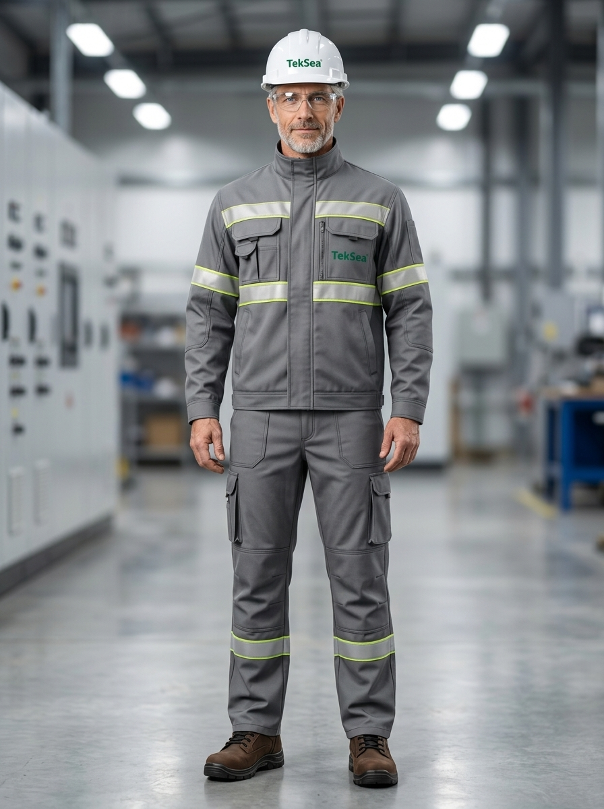

# 👤 Perfil do Personagem — Genérico 01
### TekSea — Programa de Segurança e Cultura Operacional (SIPATMA)

---

## 📌 Visão Geral & Dados Biométricos

| Atributo | Especificação |
| :--- | :--- |
| **Identificador** | `Personagem_Generico_1` |
| **Função / Cargo** | Engenheiro Eletricista Sênior / Projetista de Painéis e Bancadas de Teste |
| **Idade** | 50 anos |
| **Estatura / Biótipo** | 1,80 m — Porte físico magro e atlético |
| **Cabelos** | Comprimento médio, ondulados e grisalhos (*salt-and-pepper*) |
| **Rosto / Barba** | Barba por fazer grisalha bem delineada, traços firmes e acolhedores |
| **Olhos** | Azuis intensos |

---

## 🏃 Estilo de Vida & Hobbies

* **Corredor Diário:** Pratica corrida de rua todas as manhãs (5 km a 10 km) antes de ir para a fábrica. Essa disciplina reflete-se em seu porte físico, postura ereta, fôlego e disposição constante no trabalho.
* **Paixão por Rock:** Entusiasta de Rock clássico e progressivo (Led Zeppelin, Pink Floyd, Rush, Foo Fighters). Costuma chegar à fábrica com fones de ouvido discretos, sintonizando sua concentração para os desafios do turno.
* **Saúde e Vitalidade:** Valoriza o bem-estar físico e mental como base para uma rotina profissional de alta performance e foco inabalável.

---

## 🛠️ Atuação Profissional na TekSea

* **Engenharia "Mão na Massa":** Diferente do estereótipo do engenheiro preso ao escritório, ele transita diariamente pelos pavilhões fabris, acompanhando a montagem de chicotes, barramentos de cobre, cubículos e CCMs.
* **Ponte Técnica com o Chão de Fábrica:** Possui comunicação aberta, acessível e respeitosa com os montadores, testadores e operadores de máquinas. Sabe ouvir as dificuldades operacionais reais e ajusta os projetos para facilitar o trabalho seguro.
* **Domínio Normativo:** Amplo conhecimento prático e teórico das normas regulamentadoras e técnicas: **NR-10** (Segurança em Eletricidade), **NR-12** (Máquinas e Equipamentos) e **ABNT NBR IEC**.

---

## 🤝 Temperamento & Liderança Humanizada

* **Gentileza Natural:** É paciente, educado e nunca perde a compostura diante de imprevistos técnicos ou prazos apertados. Trata aprendizes e veteranos com a mesma atenção.
* **O Mentor dos Mais Jovens:** Visto pela equipe jovem como uma referência técnica e moral. Não impõe autoridade pelo cargo; ensina demonstrando o método correto com calma e didática.

---

## 🛡️ Filosofia de Segurança & Papel na SIPATMA

> *"Quem tem pressa na bancada de testes não corre amanhã. Segurança não é burocracia, é a precisão que garante que todos nós voltemos inteiros para casa."*

* **Liderança pelo Exemplo:** Nunca entra em área operacional sem estar 100% paramentado com todos os EPIs devidamente ajustados.
* **Cultura Preventiva:** Encara a conferência dupla, o bloqueio e etiquetagem (LOTO) e o uso do torquímetro não como perda de tempo, mas como padrão de excelência de um trabalho bem-feito.
* **Porta-Voz da SIPATMA:** Figura ideal para campanhas de conscientização, vídeos institucionais, sinalização digital e palestras técnicas internas.

---

## 🦺 Equipamentos de Proteção Individual (EPIs) Utilizados

1. **Uniforme Industrial de Alta Visibilidade TekSea (`EPI-UNI-HV01`):** Jaqueta e calça cargo em sarja cinza industrial com faixas retrorrefletivas prismáticas duplas (amarelo-limão e prata) e logo bordado no peito.
2. **Capacete de Segurança Classe B (`EPI-CAP-CLB01`):** Casco branco em ABS virgem com isolamento dielétrico (20.000 V) e logo frontal TekSea.
3. **Óculos de Segurança VisionGuard (`EPI-OCU-VG01`):** Lentes incolores com proteção lateral, curvatura base 9, tratamento antirrisco/antiembaçante e proteção UV 99,9%.
4. **Botina Dielétrica NR-10 (`EPI-CAL-NR10`):** Couro Nobuck marrom café hidrofugado, biqueira composite e solado em PU bidensidade isolante elétrico metal-free.

---
*Documentação de personagem criada para as ações de comunicação, sinalização e cultura preventiva da **SIPATMA / TekSea**.*
