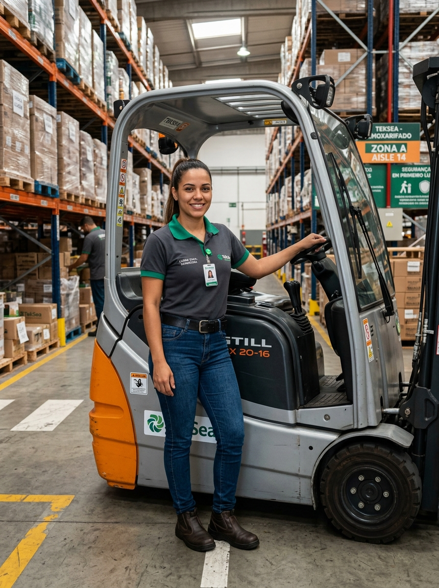

# 👤 Perfil do Personagem — Genérico 10
### TekSea — Programa de Segurança e Cultura Operacional (SIPATMA)

---

## 📌 Visão Geral & Dados Biométricos

| Atributo | Especificação |
| :--- | :--- |
| **Identificador** | `Personagem_Generico_10` |
| **Setor** | Almoxarifado Central & Logística Interna da TekSea |
| **Função / Cargo** | Operadora Especializada de Empilhadeira & Movimentação de Cargas |
| **Idade** | 29 anos |
| **Estatura / Porte** | 1,68 m — Porte físico atlético, ágil e postura firme |
| **Cabelos** | Castanho-escuros, presos em um rabo de cavalo alto e prático para o trabalho operacional |
| **Olhos / Expressão** | Olhos castanhos atentos, sorriso luminoso, confiante e determinado |

---

## 🚜 Protagonismo Operacional: Atuação na TekSea

* **Mestra da Movimentação Interna (NR-11):** Habilitada e certificada na operação de empilhadeiras elétricas retráteis, patoladas e transpaleteiras de alta elevação. Manobra com precisão milimétrica em corredores estreitos de até 2,80 metros com paletes carregados a 7 metros de altura.
* **Agilidade no Abastecimento:** Responsável por movimentar caixas pesadas de barramentos de cobre, transformadores de comando, chapas metálicas e quadros de grande porte entre as docas, o almoxarifado e as baias de montagem.
* **Quebrando Paradigmas:** É admirada por toda a fábrica pela técnica suave e controle total da máquina — sem trancos, sem quedas e com respeito rigoroso aos limites de carga.

---

## 👕 Uniforme Padrão do Almoxarifado

* **Parte Superior:** Camisa polo cinza de manga curta com gola e frisos das mangas no verde institucional TekSea, com crachá de operadora e logo da empresa bordado.
* **Parte Inferior:** Calça jeans clássica azul com corte reto e cinto de trabalho resistente.
* **Calçado de Segurança:** Botinas de segurança em couro com biqueira de composite contra esmagamento e solado antiderrapante.

---

## 🛡️ Filosofia de Segurança & Prevenção de Acidentes (NR-11)

> *"Empilhadeira não é brinquedo e o pedestre é prioridade absoluta. Buzinar nas esquinas e olhar os espelhos é reflexo que salva vidas todos os dias."*

* **Checklist Diário Rígido:** Antes de ligar a máquina no início do turno, confere freios, buzina, faróis, giroscópio de alerta visual (blue spot), sistema hidráulico e estado dos garfos. Se houver qualquer anormalidade, a máquina não opera.
* **Respeito aos Pedestres:** Nunca anda acima da velocidade regulamentar (10 km/h) e para completamente quando há colaboradores nas faixas de travessia demarcadas no piso.

---

## 🏐 Estilo de Vida & Hobbies

* **Vôlei de Praia & Esportes:** Joga vôlei nos fins de semana e adora treinar corrida funcional;
* **Paixão por Moto:** Gosta de passear de moto nos dias de folga;
* **Música Sertaneja & Churrasco:** Fã de moda de viola e sertanejo universitário, sempre animada nos encontros da fábrica.

---
*Documentação de personagem criada para as ações de comunicação, sinalização e cultura preventiva da **SIPATMA / TekSea**.*
