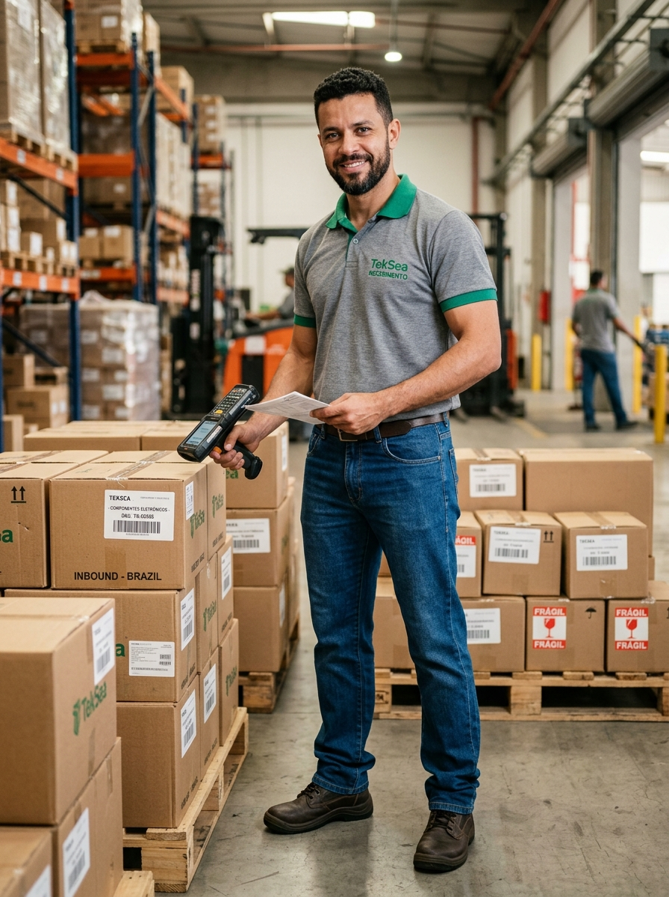

# 👤 Perfil do Personagem — Genérico 11
### TekSea — Programa de Segurança e Cultura Operacional (SIPATMA)

---

## 📌 Visão Geral & Dados Biométricos

| Atributo | Especificação |
| :--- | :--- |
| **Identificador** | `Personagem_Generico_11` |
| **Setor** | Almoxarifado & Logística de Entrada da TekSea |
| **Função / Cargo** | Conferencista de Recebimento & Inspeção de Insumos |
| **Idade** | 36 anos |
| **Estatura / Porte** | 1,82 m — Porte atlético, postura comunicativa e atenta |
| **Cabelos & Barba** | Cabelos pretos curtos texturizados; barba e bigode escuros, fechados e bem aparados |
| **Olhos / Expressão** | Olhos castanhos observadores e sorriso carismático e aberto |

---

## 🔍 O Olho Clínico das Docas: Atuação na TekSea

* **A Primeira Linha de Defesa da Fábrica:** Atua nas docas de carga e descarga. É o responsável por receber as carretas dos fornecedores, conferir notas fiscais, rastreabilidade de lotes e verificar se as caixas de componentes eletrônicos sensíveis sofreram avarias no transporte.
* **Inspeção de Conformidade Técnica:** Opera coletores de dados e leitores de código de barras a laser sem fio integrados ao ERP da TekSea. Checa dimensões, quantidades e Certificados de Aprovação (CA) dos insumos antes de liberar a entrada para o estoque verticalizado.
* **Diplomacia & Firmeza:** Tem excelente relacionamento com transportadoras e fornecedores, mas é inegociável na qualidade: se um lote de cobre ou conectores estiver fora da norma, recusa a carga na hora.

---

## 👕 Uniforme Padrão do Almoxarifado

* **Parte Superior:** Camisa polo cinza mescla em piquet com gola e frisos das mangas no verde TekSea e logo oficial bordado no peito esquerdo.
* **Parte Inferior:** Calça jeans clássica azul com corte reto e cinto de couro marrom resistente.
* **Calçado de Segurança:** Botinas de segurança em couro hidrofugado com biqueira de composite e solado bidensidade antiderrapante para piso industrial.

---

## 🛡️ Filosofia de Segurança & Boas Práticas (NR-11 e Ergonomia)

> *"A segurança da fábrica começa na doca. Descarregar com postura certa, conferir calços de roda do caminhão e manter o chão livre de pregos e paletes quebrados é dever de quem recebe."*

* **Atenção nas Docas:** Garante que nenhum caminhão seja descarregado sem os calços de segurança nas rodas e que a rampa niveladora esteja travada.
* **Ergonomia no Levantamento de Peso:** É rigoroso com os limites de peso individual (máx. 23 kg manual), utilizando paleteiras manuais ou acionando a empilhadeira para movimentação pesada, evitando lesões lombares.

---

## ⚽ Estilo de Vida & Hobbies

* **Futebol Society:** Zagueiro firme no futebol society dos amigos nas noites de quinta-feira;
* **Cozinha Caipira:** Adora cozinhar pratos tradicionais no fogão a lenha aos finais de semana;
* **Paternidade Ativa:** Dedica as folgas para brincar e passear nos parques com seus dois filhos pequenos.

---
*Documentação de personagem criada para as ações de comunicação, sinalização e cultura preventiva da **SIPATMA / TekSea**.*
