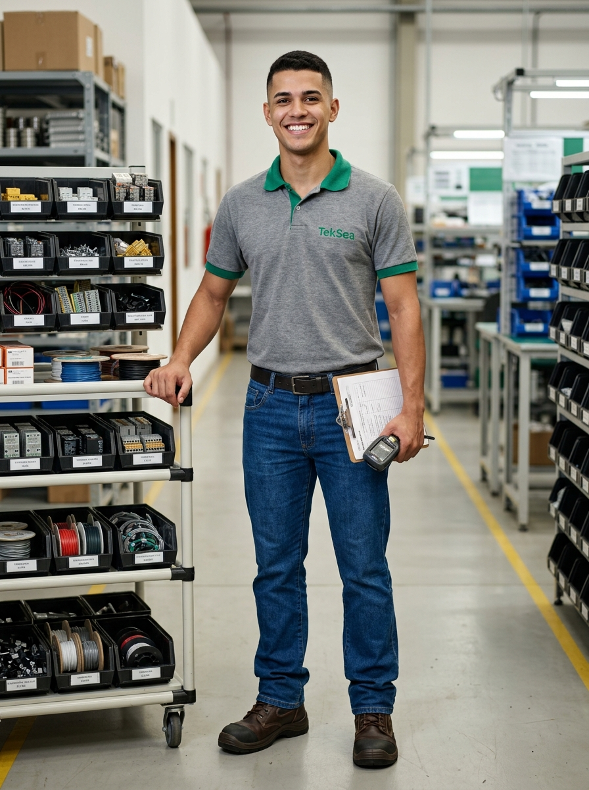

# 👤 Perfil do Personagem — Genérico 12
### TekSea — Programa de Segurança e Cultura Operacional (SIPATMA)

---

## 📌 Visão Geral & Dados Biométricos

| Atributo | Especificação |
| :--- | :--- |
| **Identificador** | `Personagem_Generico_12` |
| **Setor** | Almoxarifado Central & Separação de Materiais (Kitting) |
| **Função / Cargo** | Separador de Kits de Produção / Almoxarife Júnior |
| **Idade** | 22 anos |
| **Estatura / Porte** | 1,76 m — Porte físico esguio, atlético, ágil e postura dinâmica |
| **Cabelos** | Pretos, corte moderno curto com degradê (*fade*) bem alinhado |
| **Olhos / Expressão** | Olhos escuros brilhantes, sorriso espontâneo, radiante e cheio de entusiasmo juvenil |

---

## ⚡ A Juventude Ágil do Kitting: Atuação na TekSea

* **O Elo Veloz com a Linha de Montagem:** Opera no sistema *Just-in-Time*. É o responsável por abastecer as bancadas dos montadores (como a Personagem 2) com os carrinhos móveis de *kitting* organizados com todas as caixas de bornes, contatores, relés de proteção, canaletas e chicotes exatos para cada ordem de serviço.
* **Agilidade & Foco:** Tem uma memória visual aguçada para os códigos de peças e gaveteiros. Anda com desenvoltura e rapidez, garantindo que nenhum montador de painel fique ocioso esperando material.
* **Vontade de Crescer:** Está cursando Técnico em Eletrotécnica à noite. Faz perguntas curiosas para os engenheiros veteranos e montadores, sonhando em um dia subir para a bancada de testes ou para o P&D da TekSea.

---

## 👕 Uniforme Padrão do Almoxarifado

* **Parte Superior:** Camisa polo cinza de manga curta com gola e acabamento das mangas em verde TekSea e logo oficial bordado no peito esquerdo.
* **Parte Inferior:** Calça jeans clássica azul com corte reto e cinto de couro escuro.
* **Calçado de Segurança:** Botinas de segurança industriais em couro resistente com biqueira composite e solado antiderrapante.

---

## 🛡️ Filosofia de Segurança & Consciência Jovem (NR-11 e Circulação Segura)

> *"Ser rápido não significa correr. No almoxarifado, pressa é o caminho mais curto pra bater num colega ou derrubar material. Foco no caminho e atenção aos cruzamentos!"*

* **Respeito às Faixas de Circulação:** Conduz o carrinho de kitting sempre pelas faixas demarcadas para pedestres, parando em todos os cruzamentos com as faixas de empilhadeiras para conferir os espelhos convexos e sinais luminosos.
* **Postura Ergonômica:** Aplica rigorosamente os ensinamentos dos treinamentos: flexiona os joelhos ao retirar caixas pesadas dos níveis inferiores dos gaveteiros, protegendo a coluna lombar.

---

## 🎮 Estilo de Vida & Hobbies

* **Games & E-Sports:** Adora jogar partidas online de futebol e estratégia com os amigos à noite;
* **Futebol com a Turma:** Presença confirmada nas peladas do time do Almoxarifado contra o time da Montagem;
* **Cultura Urbana & Tênis:** Apaixonado por música pop, trap e tênis casuais de streetwear.

---
*Documentação de personagem criada para as ações de comunicação, sinalização e cultura preventiva da **SIPATMA / TekSea**.*
