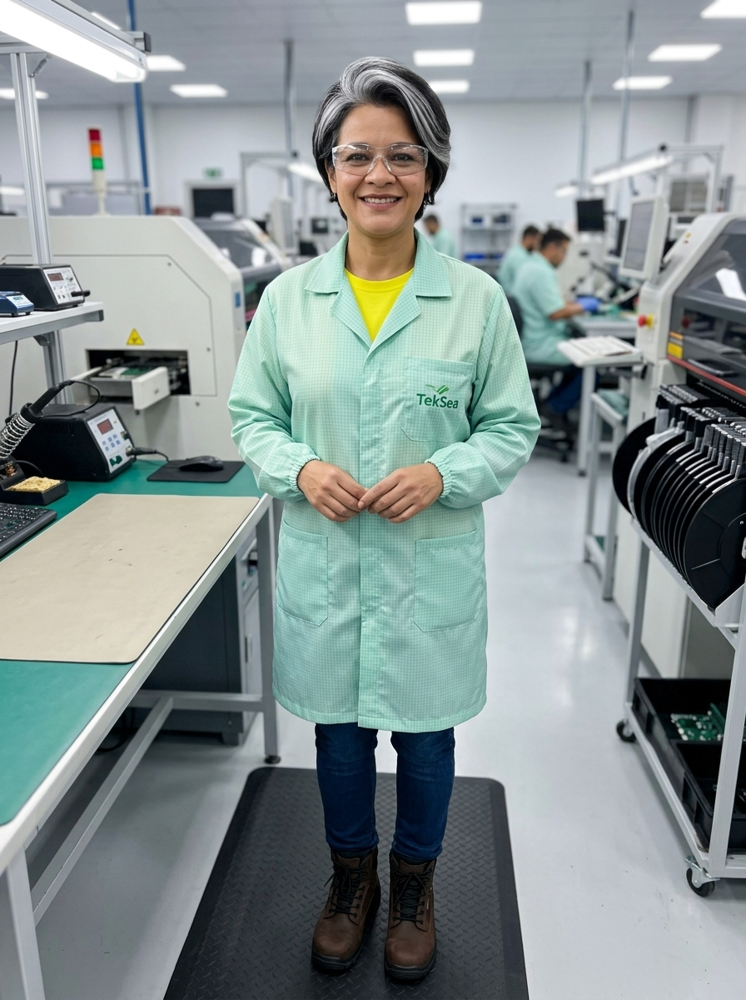

# 👤 Perfil do Personagem — Genérico 13
### TekSea — Programa de Segurança e Cultura Operacional (SIPATMA)

---

## 📌 Visão Geral & Dados Biométricos

| Atributo | Especificação |
| :--- | :--- |
| **Identificador** | `Personagem_Generico_13` |
| **Função / Cargo** | Montadora Especializada de Placas Eletrônicas (SMT / PTH) |
| **Idade** | 44 anos |
| **Estatura / Biótipo** | 1,59 m — Porte curvilíneo, postura acolhedora, firme e enérgica |
| **Cabelos** | Pretos com mechas grisalhas marcantes no topo da cabeça, em corte moderno, estiloso e elegante |
| **Rosto / Expressão** | Traços autênticos amazonenses, maçãs do rosto bem contornadas, sorriso aberto, caloroso e radiante |
| **Olhos** | Castanho-escuros amendoados e expressivos |

---

## ☀️ Estilo de Vida, Hobbies & Raízes Culturais

* **Orgulho Amazonense & Gastronomia:** Nascida no Amazonas, traz consigo a riqueza cultural, a generosidade e a hospitalidade nortista. É apaixonada por peixes de água doce assados na brasa (tambaqui, pirarucu de casaca e tucunaré acompanhados de farinha do Uarini), reunindo a família aos finais de semana para celebrar suas raízes.
* **A Força do Amarelo:** Sua cor favorita é o amarelo vibrante — símbolo de sol, energia e alegria de viver. Faz questão de usar sua camiseta amarela sob o jaleco de trabalho como sua marca pessoal de vitalidade.
* **Coração da Equipe:** Extremamente amorosa, comunicativa e atenciosa. É aquela colega que percebe quando alguém não está em um bom dia, oferecendo sempre uma palavra de carinho, um conselho sábio e um sorriso acolhedor que transforma o clima da bancada.

---

## 🛠️ Atuação Profissional na TekSea

* **Especialista em Montagem de Placas:** Atua na linha de montagem manual e inspeção visual de placas eletrônicas de circuito impresso (PCI/PCB), montagem de componentes PTH (through-hole), retoque fino e preparação para soldagem.
* **Rigor com Proteção Eletrostática (EPA - ESD):** Conhecedora profunda dos riscos de descargas eletrostáticas para componentes microeletrônicos sensíveis. Mantém sua bancada impecavelmente organizada e cumpre com rigor os protocolos antiestáticos da fábrica.
* **Destreza Manual e Precisão Cirúrgica:** Movimentos coordenados, paciência e atenção minuciosa aos detalhes para posicionamento exato de circuitos integrados, capacitores e borneiras sem danificar as trilhas condutoras.

---

## 🤝 Temperamento & Liderança Humanizada

* **Paciência & Mentoria com os Jovens:** Ensina os montadores iniciantes e aprendizes com serenidade e didática prática, transmitindo os "pulos do gato" da inserção de componentes sem jamais perder a doçura.
* **Harmonia Operacional:** É respeitada por toda a liderança e chão de fábrica pela pontualidade, lealdade e capacidade natural de apaziguar tensões cotidianas com empatia e bom humor.

---

## 🛡️ Filosofia de Segurança & Papel na SIPATMA

> *"Cada pecinha que a gente coloca nessa placa vai fazer um equipamento operar com segurança lá fora. Trabalhar com carinho, atenção e com o EPI certinho é o que garante que a gente volte inteira e feliz para quem a gente ama."*

* **Consciência Ergonômica:** Compreende a importância da postura correta na bancada, regulagem de altura do posto de trabalho e adesão total aos momentos de ginástica laboral para prevenir LER/DORT.
* **Segurança Integrada:** Utiliza os EPIs obrigatórios com naturalidade e orienta carinhosamente os colegas sobre a importância dos óculos de bancada para evitar acidentes com pontas cortadas de terminais metálicos.
* **Figura Inspiradora da SIPATMA:** Representa com perfeição a diversidade cultural, a competência feminina na indústria tecnológica e o afeto que fortalece a cultura de prevenção de acidentes.

---

## 🦺 Equipamentos de Proteção Individual (EPIs) & Vestimenta

1. **Jaleco Antiestático ESD TekSea (`EPI-JAL-ESD01`):** Confeccionado em tecido verde água/menta com filamentos contínuos de fibra de carbono em grade quadriculada para dissipação estática, botões de pressão isolados e logo TekSea bordado no peito esquerdo.
2. **Camiseta Básica Amarela:** Usada sob o jaleco com gola visível, refletindo sua identidade solar e positiva.
3. **Óculos de Segurança VisionGuard (`EPI-OCU-VG01`):** Lentes transparentes de policarbonato óptico com proteção lateral envolvente contra projeção de fragmentos e terminais de solda.
4. **Calçado de Segurança NR-10 (`EPI-CAL-NR10`):** Botina dielétrica em couro nobuck marrom café, com biqueira composite e solado isolante em PU bidensidade (100% metal-free).
5. **Tapete Antifadiga:** Utilizado na estação de trabalho para amortecimento do impacto articular e conforto na jornada.
6. **Mãos Livres:** Operação em bancada com mãos limpas, sem uso de luvas nem pulseiras conforme especificação do posto.

---
*Ficha de personagem cadastrada no acervo oficial da **SIPATMA / TekSea**.*
