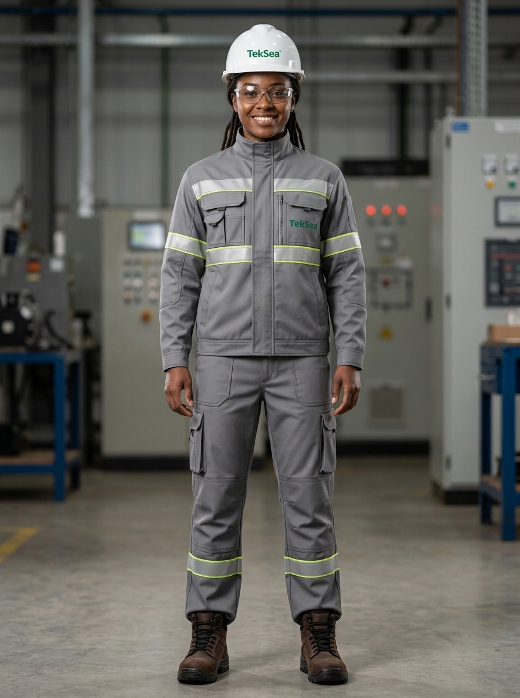

# 👤 Perfil do Personagem — Genérico 02
### TekSea — Programa de Segurança e Cultura Operacional (SIPATMA)

---

## 📌 Visão Geral & Dados Biométricos

| Atributo | Especificação |
| :--- | :--- |
| **Identificador** | `Personagem_Generico_2` |
| **Função / Cargo** | Montadora Eletromecânica de Painéis Elétricos |
| **Idade** | 27 anos |
| **Estatura / Porte** | ~1,68 m — Postura firme, atlética e altiva |
| **Etnia** | Mulher Negra |
| **Cabelos** | Dreadlocks longos e bem cuidados, presos em coque baixo estilizado na nuca durante o expediente |
| **Expressão / Rosto** | Pele radiante, olhar expressivo, sorriso seguro, carismático e determinado |

---

## 🎶 Identidade Cultural, Vaidade & Estilo de Vida

* **Amor pelo Samba-Raiz:** Apaixonada pela cadência e poesia do samba tradicional (Cartola, Dona Ivone Lara, Beth Carvalho, Clara Nunes). Para ela, o ritmo do samba traz a harmonia, a concentração e a cadência necessárias para o trabalho manual minucioso.
* **Vaidosa com Responsabilidade:** Faz questão de estar sempre impecável. Fora da fábrica solta seus longos dreads e expressa seu estilo vibrante; no trabalho, canaliza sua vaidade em manter a pele hidratada, uniforme sempre limpo e bem ajustado, e unhas aparadas e protegidas.
* **Respeito Absoluto às Normas:** Ama seguir as regras da empresa. Compreende que prender os cabelos longos sob o capacete não é abrir mão da sua beleza, mas um ato de maturidade, prevenção contra acidentes com partes móveis (NR-12) e respeito ao ambiente profissional.

---

## ⚡ Atuação Profissional na TekSea

* **A "Rainha do Chicote":** Especialista na montagem de placas de comando, chicotes elétricos, borneiras e barramentos de baixa tensão. 
* **Acabamento Impecável:** Seus painéis são referência estética e funcional na fábrica. Cada fio segue rigorosamente a canaleta com o pente de fiação perfeito, todas as anilhas de identificação legíveis e conexões crimpadas com precisão milimétrica.
* **Agilidade com Ferramental:** Domina o uso de alicates decapadores, alicates de crimpagem de terminais ilhós e pré-isolados, e chaves isoladas 1.000 V.

---

## 🛡️ Filosofia de Segurança & Papel na SIPATMA

> *"No samba e no chicote elétrico, se você errar o compasso, o resultado desanda. Segurança e capricho caminham juntos."*

* **A "Fiscal" Positiva dos Colegas:** Tem personalidade forte, decidida e franca. Se nota alguém iniciando uma tarefa sem óculos de proteção, com capacete solto ou improvisando ferramenta, ela intervém de imediato com firmeza e bom humor: *"Aqui não, parceiro! EPI completo. Segurança não se negocia."*
* **Liderança Jovem:** Prova viva para os recém-chegados de que juventude, modernidade e cumprimento rigoroso das normas de segurança combinam perfeitamente.
* **Voz Ativa na CIPA:** Sempre traz sugestões práticas de melhoria ergonômica nas bancadas e ideias criativas para as dinâmicas da SIPATMA.

---

## 🦺 Equipamentos de Proteção Individual (EPIs) Utilizados

1. **Uniforme Industrial de Alta Visibilidade TekSea (`EPI-UNI-HV01`):** Conjunto em sarja cinza industrial médio com faixas refletivas prismáticas duplas (amarelo-limão e prata) e logo TekSea bordado no bolso frontal.
2. **Capacete de Segurança Classe B (`EPI-CAP-CLB01`):** Casco branco em ABS virgem com logo frontal TekSea, assentado confortavelmente sobre a cabeça com os dreadlocks recolhidos na nuca.
3. **Óculos de Segurança VisionGuard (`EPI-OCU-VG01`):** Armação esportiva com lentes em policarbonato incolor, proteção lateral integrada e tratamento antiembaçante.
4. **Botina Dielétrica NR-10 (`EPI-CAL-NR10`):** Couro Nobuck marrom café hidrofugado, biqueira composite e solado em PU bidensidade isolante elétrico metal-free com etiqueta amarela NR-10.

---
*Documentação de personagem criada para as ações de comunicação, sinalização e cultura preventiva da **SIPATMA / TekSea**.*
