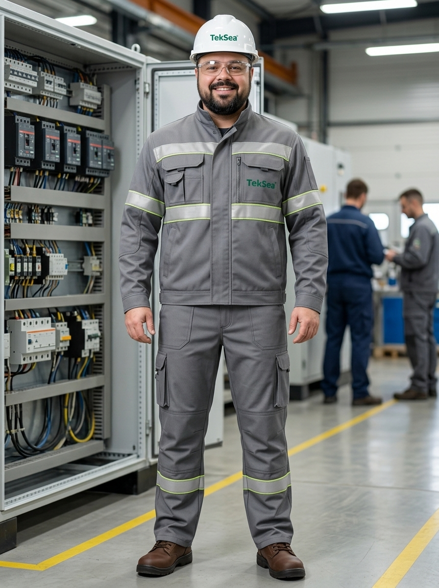

# 👤 Perfil do Personagem — Genérico 03
### TekSea — Programa de Segurança e Cultura Operacional (SIPATMA)

---

## 📌 Visão Geral & Dados Biométricos

| Atributo | Especificação |
| :--- | :--- |
| **Identificador** | `Personagem_Generico_3` |
| **Função / Cargo** | Líder de Produção / Supervisor Geral da Linha de Montagem |
| **Estatura / Porte** | 1,90 m — Porte alto, forte e levemente encorpado (*robusto/gordinho carismático*) |
| **Rosto / Barba** | Barba e bigode escuros, volumosos e muito bem alinhados; bochechas cheias e amigáveis |
| **Olhos / Expressão** | Olhos castanhos vivos, olhar acolhedor e sorriso largo, espontâneo e confiante |
| **Presença** | Imponente pela altura, mas extremamente acessível e caloroso |

---

## 🎱 Estilo de Vida, Convivência & O "Amigão da Galera"

* **O Grande Agregador:** É a alma social da fábrica. Tem o dom natural de unir pessoas, quebrar tensões e fazer com que qualquer colaborador recém-contratado se sinta acolhido desde o primeiro dia.
* **Organizador Oficial dos Eventos:** É ele quem encabeça os churrascos de confraternização, os torneios internos de sinuca no boteco perto da fábrica e os bolões de futebol. Todo mundo confia nele para organizar e celebrar as vitórias da equipe.
* **Coração Enorme:** Escuta os problemas pessoais e profissionais dos seus liderados, oferecendo apoio prático e palavras de incentivo com sinceridade e bom humor.

---

## 🏭 Atuação Profissional na TekSea

* **Liderança por Respeito, não por Pressão:** Comanda o ritmo de produção de quadros, cubículos e CCMs com firmeza e maestria, sem precisar levantar a voz. A equipe entrega resultados por consideração e admiração ao seu trabalho.
* **Visão Panorâmica do Pavilhão:** Graças à sua estatura de 1,90 m e experiência de anos no chão de fábrica, ele enxerga os gargalos, antecipa problemas de abastecimento nas bancadas e equilibra a carga de trabalho de todos.
* **Paciência e Didática:** Quando um projeto aperta, ele arregaça as mangas e apoia os montadores nas bancadas, mantendo o moral da equipe sempre alto.

---

## 🛡️ Filosofia de Segurança & Papel na SIPATMA

> *"Produção boa é aquela que termina com todo mundo são e salvo pro churrasco do final de semana. Na TekSea ninguém fica pra trás, nem na fiação e nem na segurança."*

* **O Motor do Engajamento da SIPATMA:** Campanhas de segurança só funcionam de verdade quando a liderança abraça a causa. Quando ele veste a camisa da SIPATMA e orienta sobre o uso do capacete, óculos e botina, a adesão da fábrica é de 100%.
* **Cuidado Fraterno:** Para ele, cobrar o uso correto do EPI não é seguir protocolo burocrático, é proteger seus amigos de verdade.
* **Segurança no Clima Positivo:** Faz dinâmicas, gincanas e desafios de segurança que envolvem os colaboradores com entusiasmo, transformando a prevenção em um hábito leve e coletivo.

---

## 🦺 Equipamentos de Proteção Individual (EPIs) Utilizados

1. **Uniforme Industrial de Alta Visibilidade TekSea (`EPI-UNI-HV01`):** Conjunto sob medida cinza industrial com gola alta fechada, abas protetoras de zíper, fitas refletivas prismáticas duplas (prata com bordas amarelo-limão) e logo bordado TekSea no peito.
2. **Capacete de Segurança Classe B (`EPI-CAP-CLB01`):** Casco branco em ABS virgem com isolamento elétrico certificado (20.000 V) e logo frontal TekSea.
3. **Óculos de Segurança VisionGuard (`EPI-OCU-VG01`):** Lentes monobloco incolores em policarbonato com ampla proteção lateral e hastes ergonômicas.
4. **Botina Dielétrica NR-10 (`EPI-CAL-NR10`):** Couro Nobuck marrom café hidrofugado, biqueira composite e solado PU bidensidade antiderrapante 100% metal-free, com caimento reto da calça sobre o cano.

---
*Documentação de personagem criada para as ações de comunicação, sinalização e cultura preventiva da **SIPATMA / TekSea**.*
