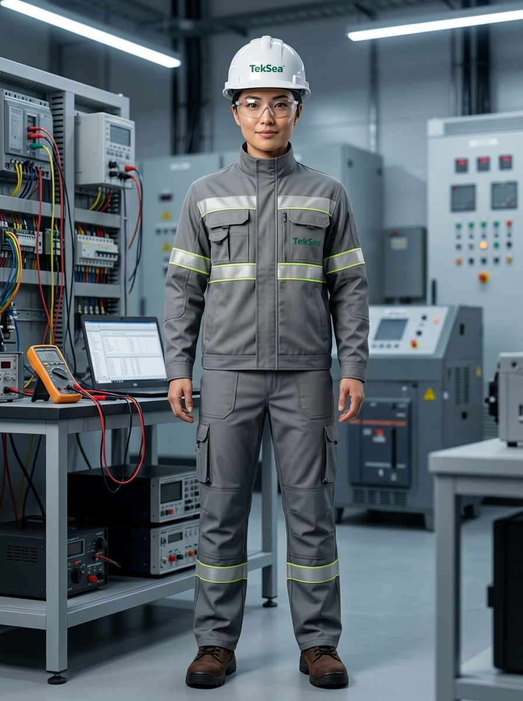

# 👤 Perfil do Personagem — Genérico 04
### TekSea — Programa de Segurança e Cultura Operacional (SIPATMA)

---

## 📌 Visão Geral & Dados Biométricos

| Atributo | Especificação |
| :--- | :--- |
| **Identificador** | `Personagem_Generico_4` |
| **Função / Cargo** | Técnica Eletrotécnica de Ensaios, Comissionamento e Qualidade Final |
| **Idade** | 31 anos |
| **Estatura / Porte** | 1,65 m — Porte ágil, atlético e postura extremamente centrada |
| **Etnia** | Nipo-Brasileira (Sansei) |
| **Cabelos** | Pretos lisos brilhantes, rigorosamente presos sob a carneira do capacete durante o turno |
| **Olhos / Expressão** | Olhos castanho-escuros penetrantes com olhar analítico aguçado e sorriso profissional sutil |

---

## ♟️ Estilo de Vida & Hobbies

* **Xadrez & Pensamento Estratégico:** Praticante assídua de xadrez rápido (*blitz*). Enxerga cada circuito e diagrama unifilar como um tabuleiro estratégico onde cada peça e conexão cumpre uma função lógica vital.
* **Trekking & Montanhismo:** Nos finais de semana de folga, recarrega as energias em trilhas ecológicas e subidas de montanha, buscando ar puro e silêncio.
* **Apreciadora de Bons Cafés:** Fã convicta de café de alta qualidade. Respeita com rigor as normas internas da fábrica que proíbem recipientes de vidro e cafeteiras individuais na área produtiva; por isso, traz de casa seu café especial já preparado em uma garrafa térmica hermética e inquebrável para saborear nos intervalos regulamentares.
* **Música nos Estudos:** Gosta de Lofi, eletrônica melódica e jazz instrumental nos fones para momentos de análise minuciosa de projetos e relatórios de conformidade.

---

## ⚡ Atuação Profissional na TekSea

* **A "Mestra dos Ensaios":** Atua na etapa decisiva da produção fabril — a Bancada de Testes e Ensaios Especiais. É ela quem aplica testes de tensão aplicada (Hi-Pot), resistência de isolamento (Megômetro), continuidade de aterramento e injeção de corrente nos disjuntores.
* **Termografia Infravermelha:** Opera câmeras termográficas calibradas para identificar microaquecimentos em barramentos de cobre e conexões parafusadas antes que o painel seja embalado.
* **Rigidez e Autonomia Técnica:** Conhecida como o "Olho Clínico" da produção. Possui autoridade total para travar o envio de qualquer painel que apresente variação milimétrica fora das tolerâncias normativas da ABNT/IEC.

---

## 🛡️ Filosofia de Segurança & Cultura Operacional

> *"A eletricidade não avisa e não perdoa suposições. Meça, comprove, bloqueie. O que os olhos não veem é exatamente o que exige mais respeito."*

* **Rigor Operacional Absoluto (NR-10):** Não faz parte da comissão da CIPAA, atuando estritamente na linha de produção técnica; contudo, sua bancada é a maior referência prática de segurança para toda a fábrica.
* **A Zona de Testes é Intocável:** Comanda a área delimitada de ensaios com disciplina exemplar. Quando a sinalização estroboscópica e os avisos de alta tensão estão ligados, ninguém ultrapassa a demarcação sem seu comando.
* **Cultura LOTO (Bloqueio & Etiquetagem):** Faz do travamento mecânico e teste de ausência de tensão uma rotina inegociável, servindo de espelho técnico para os montadores novatos.

---

## 🦺 Equipamentos de Proteção Individual (EPIs) Utilizados

1. **Uniforme Industrial de Alta Visibilidade TekSea (`EPI-UNI-HV01`):** Conjunto em sarja cinza industrial com gola alta estruturada fechada no pescoço, vista cobrindo o zíper frontal, bolsos técnicos com logo bordado TekSea e faixas retrorrefletivas prismáticas duplas (prata com frisos amarelo-limão).
2. **Capacete de Segurança Classe B (`EPI-CAP-CLB01`):** Casco branco em ABS virgem com isolamento elétrico certificado (20.000 V) e logo frontal TekSea.
3. **Óculos de Segurança VisionGuard (`EPI-OCU-VG01`):** Lentes monobloco incolores em policarbonato com proteção lateral e tratamento antirrisco/antiembaçante.
4. **Botina Dielétrica NR-10 (`EPI-CAL-NR10`):** Couro Nobuck marrom café legítimo hidrofugado, biqueira composite e solado em PU bidensidade antiderrapante dielétrico, com a calça de corte reto caindo perfeitamente sobre o cano.

---
*Documentação de personagem criada para as ações de comunicação, sinalização e cultura preventiva da **SIPATMA / TekSea**.*
