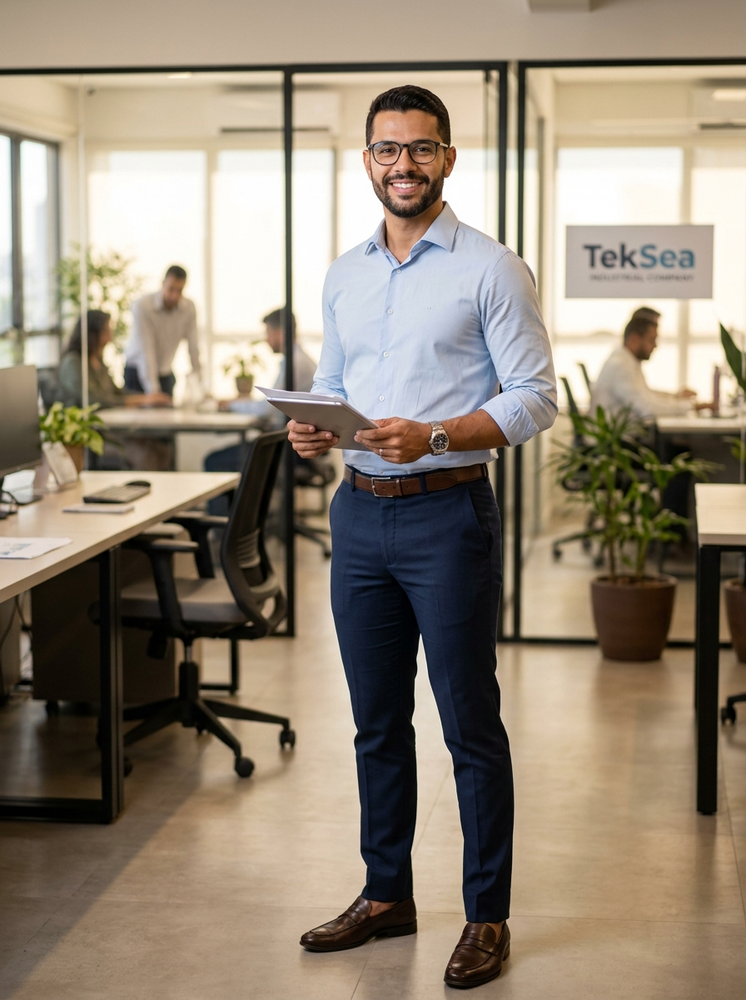

# 👤 Perfil do Personagem — Genérico 05
### TekSea — Programa de Segurança e Cultura Operacional (SIPATMA)

---

## 📌 Visão Geral & Dados Biométricos

| Atributo | Especificação |
| :--- | :--- |
| **Identificador** | `Personagem_Generico_5` |
| **Função / Cargo** | Comprador Técnico / Especialista em Suprimentos & Supply Chain |
| **Lotação** | Escritório Administrativo e Comercial da TekSea |
| **Idade** | 31 anos |
| **Estatura / Porte** | 1,75 m — Porte físico esguio e postura elegante |
| **Etnia** | Pardo |
| **Cabelos & Barba** | Cabelo escuro impecavelmente penteado e alinhado; barba baixa, fechada e milimetricamente desenhada |
| **Olhos / Acessórios** | Olhos castanhos expressivos, óculos de grau modernos de acetato escuro |
| **Expressão** | Sorriso aberto, acolhedor, charmoso e espontâneo; presença carismática |

---

## 👔 Estilo Visual & Elegância no Escritório

* **Sempre Bem Vestido:** Como o setor administrativo não adota uniforme fabril, ele se destaca pelo bom gosto e caimento impecável:
  * Camisa social em algodão nobre azul-claro com mangas dobradas no antebraço;
  * Calça de alfaiataria moderna em tom azul-marinho;
  * Cinto de couro marrom refinado e calçados clássicos (mocassim/loafer de couro);
  * Relógio elegante de aço inoxidável.
* **Profissionalismo & Apresentação:** Sua presença transmite sofisticação, organização e clareza, gerando confiança imediata tanto com fornecedores externos quanto com a diretoria.

---

## 🤝 Convivência & O "Querido por Todos"

* **Afinidade e Empatia Universal:** É gay, assumido, seguro de si e muito respeitado. Sua simpatia genuína, educação no trato e inteligência emocional fazem dele uma das pessoas mais estimadas e bem-quistas da empresa inteira.
* **Sem Barreiras entre Escritório e Fábrica:** Diferente do distanciamento comum entre setores administrativos e operacionais, ele tem ótimo trânsito com o pessoal das bancadas, os eletricistas e a expedição. Todos adoram quando ele desce para conversar.
* **Liderança Inclusiva Natural:** Embora **não faça parte da comissão da CIPAA** (cujos membros serão desenvolvidos oportunamente), ele atua naturalmente como catalisador de um ambiente de trabalho acolhedor, diverso e livre de preconceitos.

---

## 📦 Atuação Profissional na TekSea

* **Guardião da Qualidade dos Insumos:** Como Comprador Técnico, é o responsável por negociar componentes elétricos de ponta (disjuntores, barramentos de cobre, contatores, cabos normatizados) e homologar fornecedores confiáveis.
* **O Comprador dos EPIs:** É quem garante que todos os Equipamentos de Proteção Individual adquiridos pela TekSea possuam **Certificado de Aprovação (CA)** emitido pelo Ministério do Trabalho válido e correspondam exatamente às fichas técnicas normativas (NR-06 e NR-10).

---

## 🛡️ Relação com a Segurança & O Exemplo do Escritório

> *"Segurança e qualidade começam na escolha certa. Cuidar de quem faz a fábrica girar é a nossa melhor negociação."*

* **O Fim do "Vou só dar um pulinho na fábrica":** Não cai na armadilha comum de entrar na área industrial sem proteção. Sempre que precisa descer ao pavilhão fabril para inspecionar um lote de insumos ou alinhar prazos com o Líder de Produção, ele passa na antecâmara, calça o sapato fechado/botina de segurança, coloca os óculos de proteção e o capacete branco de técnico/visitante.
* **Segurança é Para Todos:** Demonstra na prática que as regras da fábrica são soberanas e valem igualmente para a diretoria, o escritório e a linha de montagem.

---

## 🌿 Estilo de Vida & Hobbies

* **Gastronomia & Vinhos:** Cozinheiro de mão cheia nos finais de semana, adora receber os amigos para jantares intimistas;
* **Urban Jungle:** Cultiva uma impressionante coleção de plantas ornamentais em seu apartamento;
* **Artes & Viagens:** Gosta de exposições de arte, feiras de design, cinema e viagens culturais nas férias.

---
*Documentação de personagem criada para as ações de comunicação, sinalização e cultura preventiva da **SIPATMA / TekSea**.*
