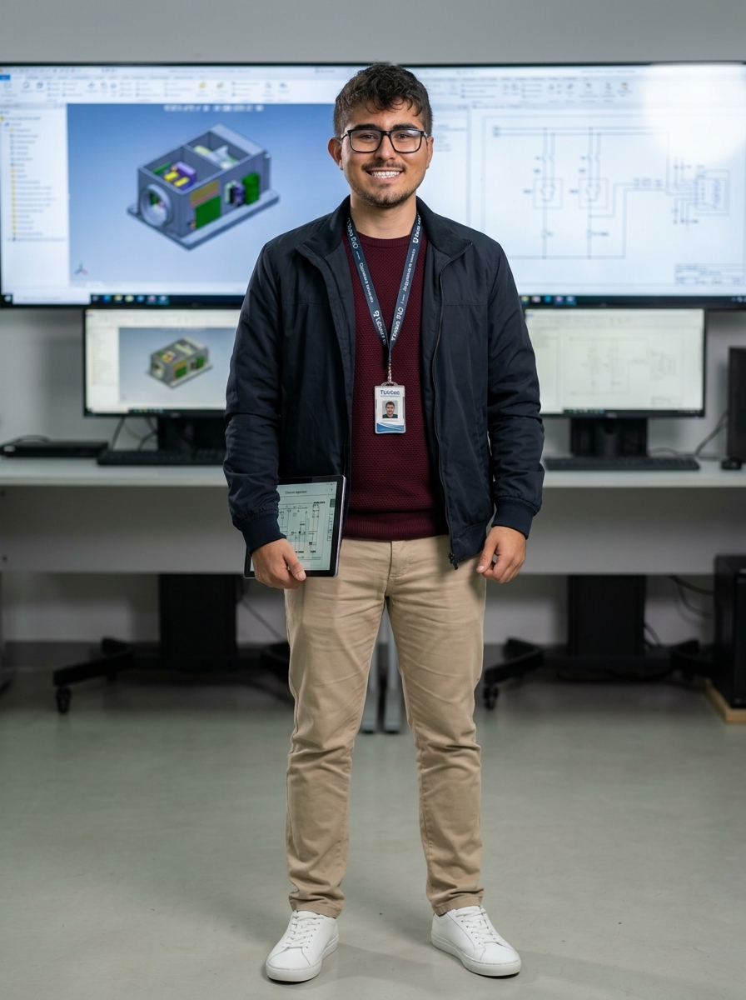

# 👤 Perfil do Personagem — Genérico 06
### TekSea — Programa de Segurança e Cultura Operacional (SIPATMA)

---

## 📌 Visão Geral & Dados Biométricos

| Atributo | Especificação |
| :--- | :--- |
| **Identificador** | `Personagem_Generico_6` |
| **Função / Cargo** | Engenheiro Chefe de P&D / Head de Inovação & Novos Produtos |
| **Lotação** | Laboratório de Pesquisa & Desenvolvimento (P&D) da TekSea |
| **Idade** | 30 anos |
| **Estatura / Porte** | 1,74 m — Porte físico jovem, atlético e equilibrado |
| **Cabelos & Barba** | Cabelos castanho-escuros com ondas e textura natural no topo; barba e bigode escuros, curtos e muito bem aparados contornando o maxilar |
| **Olhos / Acessórios** | Olhos castanhos expressivos e brilhantes; óculos de grau modernos de armação retangular preta |
| **Expressão** | Sorriso largo, aberto e contagiante; postura carismática, acessível e inspiradora |

---

## 💻 Estilo Visual & O "Tech Smart Casual"

* **Apresentação Moderna de Engenharia:** Representa a nova geração da engenharia elétrica industrial que une rigor técnico e descontração:
  * Suéter de tricô fino cor vinho/borgonha sobreposto com elegância por jaqueta casual técnica azul-marinho;
  * Calça chino sob medida em tom cáqui/areia;
  * Tênis casual branco minimalista de couro, alinhando conforto e sofisticação urbana;
  * Cordão oficial com crachá corporativo de identificação de P&D e tablet industrial com diagramas e modelos 3D dos painéis.
* **Ambiente de Trabalho:** Atua no laboratório de inovação da TekSea, cercado por monitores ultra-wide de CAD com modelos digitais tridimensionais (*Digital Twins*), protótipos de placas eletrônicas e bancadas de testes de automação.

---

## 🚀 Atuação Profissional na TekSea

* **Líder da Inovação & Painéis Inteligentes:** Comanda a equipe responsável por projetar a próxima geração de painéis elétricos inteligentes (*Smart Panels*), integrando sensores de telemetria IoT, monitoramento térmico contínuo e eficiência energética.
* **Acessibilidade e Diálogo com a Produção:** Não cria projetos isolado em um escritório. Desce constantemente à linha de produção para conversar com a Montadora (Personagem 2), a Técnica de Testes (Personagem 4) e o Líder de Produção (Personagem 3), colhendo feedbacks reais para aprimorar os desenhos técnicos.
* **Modelagem 3D & Simulação:** Especialista em softwares de modelagem paramétrica tridimensional, simulação térmica e ensaios virtuais de dinâmica de ar e arco elétrico.

---

## 🛡️ Filosofia de Segurança: "Safety by Design"

> *"Inovação de verdade é aquela que torna a tecnologia mais inteligente e a vida das pessoas mais segura. Se não for seguro e ergonômico pra quem monta o painel no chão de fábrica, o projeto não está pronto."*

* **Segurança Começa na Prancheta:** Para ele, a prevenção de acidentes nasce no P&D. Ele desenha os painéis com canaletas mais largas (evitando lesões por esforço repetitivo dos montadores), barreiras físicas isolantes contra toque acidental (NR-10) e sistemas de alívio de sobrepressão à prova de arco elétrico (NR-12).
* **O Exemplo em Campo:** Sempre que vai ao pavilhão industrial realizar testes físicos de protótipos em bancada, equipa-se rigorosamente com capacete branco de engenharia, óculos VisionGuard e botinas dielétricas.

---

## ✈️ Estilo de Vida & A Alma Viajante

* **Explorador do Mundo:** Viajante entusiasta em suas férias e folgas. Adora alternar entre paraísos naturais e praias tropicais (como Jericoacoara) e grandes cidades históricas com arquiteturas desafiadoras (como Barcelona e a Sagrada Família).
* **Curiosidade Cultural & Fotografia:** Traz dessas viagens inspirações estéticas e soluções arquitetônicas que acabam influenciando o design limpo e funcional dos produtos TekSea.
* **Espírito Jovem e Esportivo:** Fã de passeios ao ar livre, caminhadas urbanas e momentos descontraídos com os amigos.

---
*Documentação de personagem criada para as ações de comunicação, sinalização e cultura preventiva da **SIPATMA / TekSea**.*
