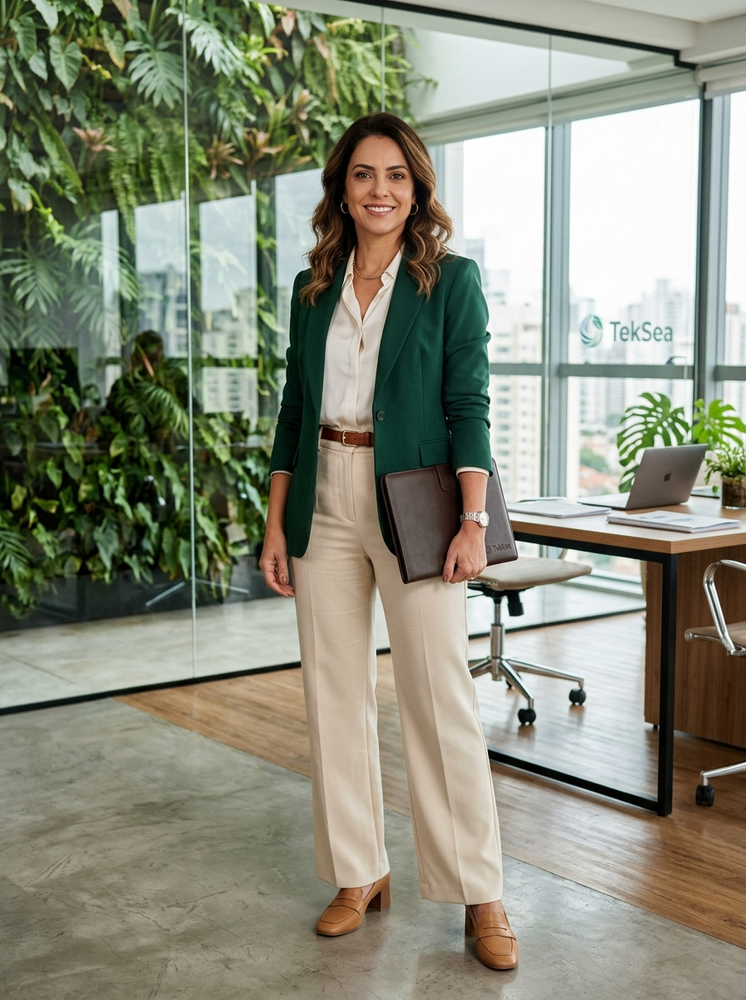

# 👤 Perfil do Personagem — Genérico 07
### TekSea — Programa de Segurança e Cultura Operacional (SIPATMA)

---

## 📌 Visão Geral & Dados Biométricos

| Atributo | Especificação |
| :--- | :--- |
| **Identificador** | `Personagem_Generico_7` |
| **Função / Cargo** | Gerente de Sustentabilidade, Meio Ambiente (ESG) & Governança Corporativa |
| **Lotação** | Diretoria Executiva e Escritório Corporativo da TekSea |
| **Idade** | 44 anos |
| **Estatura / Porte** | 1,70 m — Porte elegante, postura altiva, firme e naturalmente acolhedora |
| **Cabelos** | Castanho-escuros na altura dos ombros, ondulados, com mechas sutis em tons mel e caramelo |
| **Olhos / Expressão** | Olhos castanho-claros calorosos; sorriso sereno, inteligente e que transmite serenidade e liderança madura |

---

## 🌿 O Elemento Surpresa: A Força do "MA" na SIPATMA

* **A Guardiã do Meio Ambiente:** Muitas vezes as pessoas associam a SIPATMA apenas aos acidentes de trabalho mecânicos ou elétricos, esquecendo que o **"MA"** significa **Meio Ambiente**. Ela é a líder que personifica esse pilar essencial da TekSea.
* **Sustentabilidade Industrial na Prática:** É a responsável pela gestão da pegada de carbono da fábrica, programa de reciclagem e logística reversa de aparas de cobre nobre, destinação correta de solventes e tintas de painéis e neutralização de resíduos eletrônicos.
* **Contratos com Gigantes Globais:** Conduz as rigorosas auditorias ambientais exigidas por multinacionais de energia solar e eólica que compram os painéis da TekSea.

---

## 🏛️ Estilo Visual & Elegância Corporativa

* **Smart Corporate Chic em Verde TekSea:**
  * Blazer de alfaiataria estruturado no verde esmeralda institucional da TekSea;
  * Blusa fluida off-white em crepe de seda com caimento impecável;
  * Calça de alfaiataria pantalona em tom areia/creme com cinto de couro refinado;
  * Sapatos de salto bloco elegantes em couro caramelo;
  * Pasta executiva em couro nobre marrom para relatórios de conformidade e contratos.
* **Ambiente de Trabalho:** Atua em um escritório executivo contemporâneo e sustentável, ladeado por um imponente jardim vertical interno de plantas naturais e iluminação ampla.

---

## 🤝 Convivência & Relação com a Fábrica

* **Liderança pelo Diálogo:** É respeitadíssima em todos os níveis hierárquicos. Trata os estagiários, a diretoria e os montadores operacionais com a mesma elegância, clareza e respeito genuíno.
* **Parceria com a Cultura Preventiva:** Embora **não seja membra da CIPAA** (cujos membros serão nomeados em etapa posterior), sua gerência é a principal parceira da comissão em campanhas de conscientização ambiental, gestão de resíduos e saúde mental.
* **Auditorias de Campo:** Quando desce aos pavilhões fabris para verificar as bacias de contenção de óleos ou a área de descarte da usinagem, nunca abre mão de vestir capacete de engenharia, óculos de proteção e calçado regulamentar fechado.

---

## 🛡️ Filosofia de Segurança & Gestão Ambiental

> *"Segurança e sustentabilidade nascem da mesma raiz: o respeito à vida, às pessoas e ao legado do que construímos hoje para o amanhã."*

* **Visão Integrada (QSMS):** Para ela, uma fábrica que desperdiça material ou polui é uma fábrica desatenta — e desatenção gera acidentes. O rigor ambiental e a segurança do trabalho andam de mãos dadas.

---

## 🎻 Estilo de Vida & Hobbies

* **Música Clássica & Cordas:** Toca violoncelo nas horas vagas, encontrando na música a harmonia e o foco para as tomadas de decisões corporativas;
* **Bem-Estar & Saúde:** Praticante regular de Pilates matinal e caminhadas ao ar livre;
* **Apreciadora de Vinhos & Botânica:** Apaixonada pelo cultivo de orquídeas e degustação de vinhos artesanais em viagens de fim de semana pela serra.

---
*Documentação de personagem criada para as ações de comunicação, sinalização e cultura preventiva da **SIPATMA / TekSea**.*
