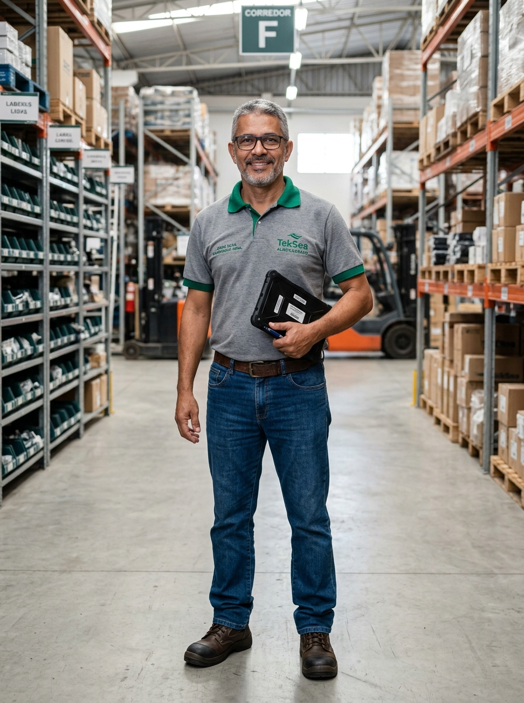

# 👤 Perfil do Personagem — Genérico 09
### TekSea — Programa de Segurança e Cultura Operacional (SIPATMA)

---

## 📌 Visão Geral & Dados Biométricos

| Atributo | Especificação |
| :--- | :--- |
| **Identificador** | `Personagem_Generico_9` |
| **Setor** | Almoxarifado Central & Gestão de Estoque da TekSea |
| **Função / Cargo** | Encarregado Geral de Estoque & Inventário |
| **Idade** | 52 anos |
| **Estatura / Porte** | 1,78 m — Porte ereto, sereno e experiente |
| **Cabelos** | Curtos, grisalhos (*salt-and-pepper*) bem aparados |
| **Olhos / Acessórios** | Olhos castanho-escuros amigáveis, óculos de grau modernos de armação retangular escura |
| **Expressão** | Sorriso confiante, tranquilo e acolhedor; postura de quem tem a fábrica inteira na memória |

---

## 📦 O Guardião do Almoxarifado: Atuação na TekSea

* **A Memória Viva do Estoque:** Atua há mais de 15 anos na gestão de materiais. Conhece cada um dos milhares de códigos de itens da TekSea — de parafusos de aterramento e bornes até barramentos de cobre nobre de alta espessura e disjuntores de caixa moldada de 1.600 A.
* **Mestre do Sistema WMS/ERP:** Controla as entradas, baixas e transferências em tempo real no tablet industrial reforçado. Com ele, o inventário bate na casa decimal.
* **Organização Milimétrica:** Implementou a sinalização visual e metodologia 5S nos corredores de porta-paletes do galpão, garantindo que nenhum item fique fora de posição.

---

## 👕 Uniforme Padrão do Almoxarifado

* **Parte Superior:** Camisa polo cinza mescla de manga curta em piquet de alta resistência, com gola polo canelada e acabamentos das mangas no verde esmeralda TekSea, ostentando o logo oficial da empresa bordado no peito esquerdo.
* **Parte Inferior:** Calça jeans clássica em lavagem azul-escura com corte reto resistente e cinto de couro marrom.
* **Calçado de Segurança:** Botinas industriais em couro resistente com biqueira protetora contra queda acidental de cargas e solado antiderrapante.

---

## 🛡️ Filosofia de Segurança & Cultura Preventiva (NR-11 e NR-12)

> *"Um parafuso fora do lugar hoje é um painel atrasado amanhã. E uma caixa mal empilhada é um risco pra quem passa. Segurança no estoque é organizar pensando no colega."*

* **Rigor com Armazenagem (NR-11):** Inspeciona diariamente a verticalização das cargas nos porta-paletes, capacidade de carga das longarinas e a desobstrução total das rotas de fuga e faixas de pedestres.
* **Respeito aos Pedestres e Máquinas:** Mantém tolerância zero com quem anda distraído nos corredores de empilhadeiras. 

---

## ☕ Estilo de Vida & Hobbies

* **Passeios de Domingo:** Adora viajar de carro pelo interior com a esposa nos finais de semana;
* **Churrasco em Família:** É o churrasqueiro oficial dos almoços de domingo com os filhos e netos;
* **Marcenaria por Hobby:** Gosta de restaurar móveis antigos de madeira maciça em sua oficina caseira.

---
*Documentação de personagem criada para as ações de comunicação, sinalização e cultura preventiva da **SIPATMA / TekSea**.*
